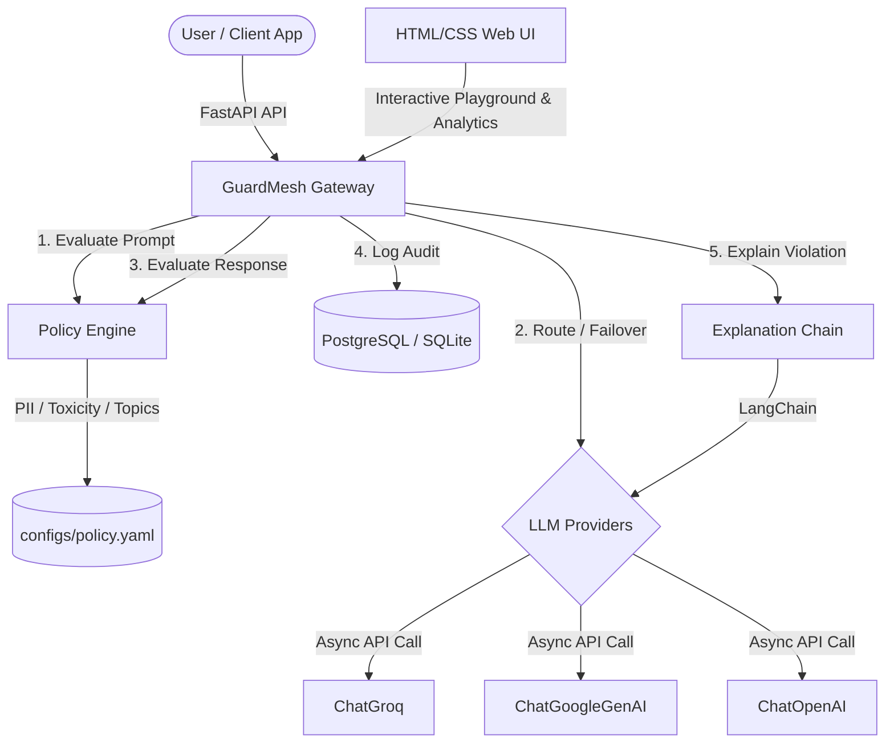

# GuardMesh -- Enterprise-Grade AI Governance Platform

**One policy. Every model. Unified AI governance across LLM providers.**

---

## 📖 Overview

GuardMesh acts as a centralized, high-performance security and compliance gateway positioned in front of multiple Large Language Model (LLM) providers. By standardizing policy enforcement, GuardMesh ensures that every prompt sent by users and every response generated by external APIs is evaluated against a unified security standard before reaching its destination.

This project uses **FastAPI**, **LangChain**, **scikit-learn**, Vanilla **HTML/CSS/JS** Web UI, and supports **PostgreSQL** in production with a seamless **SQLite** fallback for local development.

---

## 🏗️ Architecture

The GuardMesh gateway intercepts and inspects all requests going to LLM backends:



---

## 🛠️ Key Features

1. **Unified Policy Engine & Overlay Rules**: Enforces base governance rules while supporting provider-specific overlay policies (e.g. Groq strict toxicity threshold 0.4, Gemini PII blocking, OpenAI PII bypass).
2. **Integrated HTML/CSS Web UI**: Mounts directly at `/ui` (and redirects from `/`) providing an Interactive Playground, Audit & Analytics, and live Policy Specification Editor.
3. **Provider Failover & Retry**: Automatically retries a failed provider once. If the retry fails, it seamlessly routes the request to another healthy configured provider to ensure maximum uptime.
4. **Structured Explainability**: Blocked/redacted responses return a detailed explanation structure (remediation suggestion, violated policy, action taken, and LangChain-derived explanation).
5. **Rich Auditing Database**: Records request IDs (UUID), prompt/response hashes, triggered policies, detected violations, detailed latencies, and versioning.

---

## ⚙️ Environment Variables

| Variable | Description | Default / Example |
|---|---|---|
| `DATABASE_URL` | The PostgreSQL or SQLite connection string | `sqlite:///./guardmesh.db` |
| `GUARDMESH_DB_URL` | DB URL fallback | `sqlite:///./guardmesh.db` |
| `OPENAI_API_KEY` | OpenAI Developer Key | `sk-proj-...` |
| `GEMINI_API_KEY` | Google Gemini Developer Key | `AIzaSy...` |
| `GROQ_API_KEY` | Groq Console Key | `gsk_...` |
| `GUARDMESH_API_KEY` | Gateway API key (Optional) | `my-secret-token` |
| `POLICY_PATH` | Path to policy definition | `configs/policy.yaml` |

---

## 🚀 Local Quickstart

Start the FastAPI Gateway and Web UI locally:

```bash
python run.py
```

* **HTML/CSS Web UI**: [http://127.0.0.1:8000/ui](http://127.0.0.1:8000/ui)
* **Swagger API Docs**: [http://127.0.0.1:8000/docs](http://127.0.0.1:8000/docs)

---

## 📦 Containerized Deployment (Docker)

Spin up the entire stack with Docker Compose:

```bash
docker compose up --build
```

* **API Gateway & Web UI**: Runs on [http://localhost:8000](http://localhost:8000).

---

## 🔌 API Reference

### GET `/health`
Returns system health status and LLM provider connections.
```json
{
  "status": "healthy",
  "database": "connected",
  "policy_version": "1.0.0",
  "providers": {
    "openai": "healthy",
    "gemini": "healthy",
    "groq": "healthy"
  },
  "uptime": "153s",
  "version": "1.0.0"
}
```

### POST `/chat`
Evaluates and routes prompts across LLM providers.
```json
{
  "provider": "groq",
  "prompt": "What is GuardMesh?"
}
```
