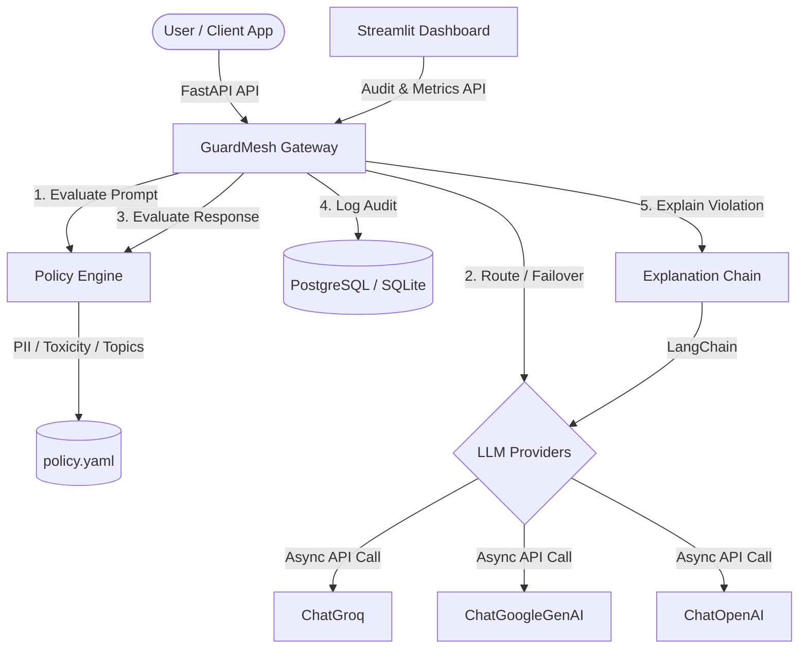

# GuardMesh -- Enterprise-Grade AI Governance Platform

**One policy. Every model. Unified AI governance across LLM providers.**

---

## 📖 Overview

GuardMesh acts as a centralized, high-performance security and compliance gateway positioned in front of multiple Large Language Model (LLM) providers. By standardizing policy enforcement, GuardMesh ensures that every prompt sent by users and every response generated by external APIs is evaluated against a unified security standard before reaching its destination.

This project uses **FastAPI**, **LangChain**, **scikit-learn**, and supports **PostgreSQL** in production with a seamless **SQLite** fallback for local development.

---

## 🏗️ Architecture

The GuardMesh gateway intercepts and inspects all requests going to LLM backends:



---

## 🛠️ Key Features

1. **Unified Policy Engine**: Inspects prompts and responses for PII, toxic language, and blocked topics locally using keyword rules and TF-IDF semantic similarity checking.
2. **Provider Failover & Retry**: Automatically retries a failed provider once. If the retry fails, it seamlessly routes the request to another healthy configured provider to ensure maximum uptime.
3. **Structured Explainability**: Blocked/redacted responses return a detailed explanation structure (remediation suggestion, violated policy, action taken, and LangChain-derived explanation).
4. **Rich Auditing Database**: Records request IDs (UUID), prompt/response hashes, triggered policies, detected violations, detailed latencies, and versioning.
5. **Real-time Status Dashboard**: An upgraded Streamlit interface charting metrics, policy violations, average latencies, provider health, and recent audit trails.

---

## ⚙️ Environment Variables

| Variable | Description | Default / Example |
|---|---|---|
| `DATABASE_URL` | The PostgreSQL or SQLite connection string | `sqlite:///./guardmesh.db` |
| `GUARDMESH_DB_URL` | DB URL fallback | `sqlite:///./guardmesh.db` |
| `OPENAI_API_KEY` | OpenAI Developer Key | `sk-proj-...` |
| `GEMINI_API_KEY` | Google Gemini Developer Key | `AIzaSy...` |
| `GROQ_API_KEY` | Groq Console Key | `gsk_...` |
| `GUARDMESH_API_KEY` | Gateway API key (Optional) | `my-secret-token` |
| `POLICY_PATH` | Path to policy definition | `configs/policy.yaml` |

---

## 📦 Containerized Deployment (Docker)

Ensure you copy `.env.example` to `.env` and fill in your active provider API keys.

### Running with Docker Compose

Spin up the entire stack (PostgreSQL database, FastAPI gateway, and Streamlit dashboard) with a single command:

```bash
docker compose up --build
```

*   **API Service**: Runs on [http://localhost:8000](http://localhost:8000) (includes health checks).
*   **Dashboard Service**: Runs on [http://localhost:8501](http://localhost:8501).

---

## 🔌 API Reference

### GET `/health`
Returns the unauthenticated system status and metrics.
*   **Response**:
    ```json
    {
      "status": "healthy",
      "database": "connected",
      "policy_version": "1.0.0",
      "providers": {
        "openai": "unhealthy",
        "gemini": "healthy",
        "groq": "healthy"
      },
      "uptime": "153s",
      "version": "1.0.0"
    }
    ```

### GET `/providers`
Returns unauthenticated status of LLM provider connections.
*   **Response**:
    ```json
    {
      "openai": "unhealthy",
      "gemini": "healthy",
      "groq": "healthy"
    }
    ```

### POST `/chat`
Sends a prompt to the policy engine and routes to the provider.
*   **Request**:
    ```json
    {
      "provider": "groq",
      "prompt": "What is the capital of France?",
      "model": "optional-model-override"
    }
    ```
*   **Response**:
    ```json
    {
      "provider": "groq",
      "model": "llama-3.1-8b-instant",
      "response": "The capital of France is Paris.",
      "action_taken": "allowed",
      "triggered_policy": null,
      "explanation": null,
      "explanation_details": null,
      "latency_ms": 320.12,
      "status": "success"
    }
    ```

---

## 🔮 Future Enhancements

- **Caching Layer**: Integrate Redis caching to store model completions for identical redacted prompts, reducing cost.
- **Dynamic Policy Reload**: Push updates to `policy.yaml` through S3 event triggers to update configurations across tasks without service interruption.
- **Custom Policy Rules**: Add a compiler for custom policies allowing regular expression mappings inside the dashboard directly.
